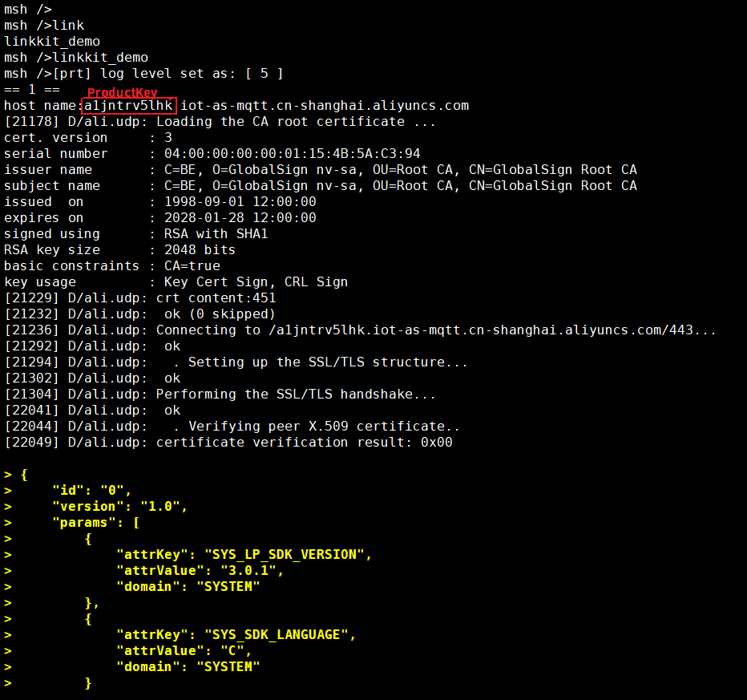

# RENESAS + RT-Thread 电位计 DEMO

## 简介

这是一个基于 RA6M4-IOT 开发板 + RT-Thread 实现的电位计传感器 DEMO。

本文将介绍如何一步步从零搭建一个传感器网关。

下图是整体的设计框图， 板载电位计传感器使用 ADC 接口接入主控芯片，EC20 用于网络通信。在主控芯片中添加所需要的软件包、组件等中间件来快速搭建起一个传感器网关。

 

## 实际运行效果
1、在 msh 中输入`linkkit_demo` 命令创建并启动 demo 线程

 

2、在云平台的设备调试页面查看实时刷新的数据。

 

## 准备工作

- RA6M4-IOT 开发板
- RT-Thread 中 RA6M4-IOT 的 BSP [Github](https://github.com/RT-Thread/rt-thread/tree/master/bsp/renesas/ra6m4-iot) / [Gitee](https://gitee.com/rtthread/rt-thread/tree/master/bsp/renesas/ra6m4-iot) 
- 网络驱动模块：[PPP_Device ](https://github.com/RT-Thread-packages/ppp_device)
- 浮点数完全支持扩展包：[rt_vsnprintf_full ](https://github.com/mysterywolf/rt_vsnprintf_full)
- 阿里云：[生活物联网平台](https://living.aliyun.com/)

## 实现过程

1、下载 rt-thread 源码和必备的开发工具，参考 `/bsp/renesas/ra6m4-iot/` 路径下的 [README](https://github.com/RT-Thread/rt-thread/tree/master/bsp/ra6m4-cpk) 搭建好软件开发环境。编译下载初始工程，验证系统正常运行。

2、将传感器模块和网络模块连接开发板。

|    模块    |  模块引脚  | 开发板引脚 |         MCU引脚编号         |
| :--------: | :--------: | :--------: | :-------------------------: |
| **HS3001** | PMOD 接口  |   PMOD B   |    P410(SCL)、P411(SDA)     |
|  **EC20**  | PCI-E 接口 |   UART2    |  插上 EC20,使能 uart2 即可  |
|   **SD**   | SDHI 接口  |   B only   | 配置为 1-Bit 模式，插卡即可 |

- 开发板示意图

 

- 实物连接图

 

3、配置所需要的软件包、组件、外设驱动

- [PPP_Device](https://packages.rt-thread.org/detail.html?package=ppp_device) 软件包配置：参考文档路径 `bsp/renesas/ra6m4-iot/docs/使用PPP方式上网.md`

- [ali-iotkit](http://packages.rt-thread.org/detail.html?package=ali-iotkit) 软件包配置：
  
  - [云平台](https://living.aliyun.com/)创建项目，创建完成后点击项目进入配置

 

- 在新建的项目中创建产品

 

  - 配置产品功能定义

    
  - 进入设备调试页面选择将页面拉到最下方选择 “未认证模组”

 

  - 新增测试设备，输入 DeviceName

 

  - 进入详情页查看设备三元组信息

 

 

  - 在 menuconfig 中开启 ali-iotkit 软件包，将新创建的产品三元组信息填入配置项中。
  > 注意：三元组信息是一机一密，所以不能有两个以上的设备使用同一组三元组信息。
    

- 保存 menuconfig 配置，输入命令更新软件包 ` pkgs --update`，输入命令生成 MDK 工程 ` scons --target=mdk5`

 

- 将 /demo/ 目录加入工程中

 

 

## 开源代码

整个 demo 的全部代码都会开源到 Github：[跳转链接](https://github.com/ShermanShao/renesas_demos) 

## 更多详细资料

